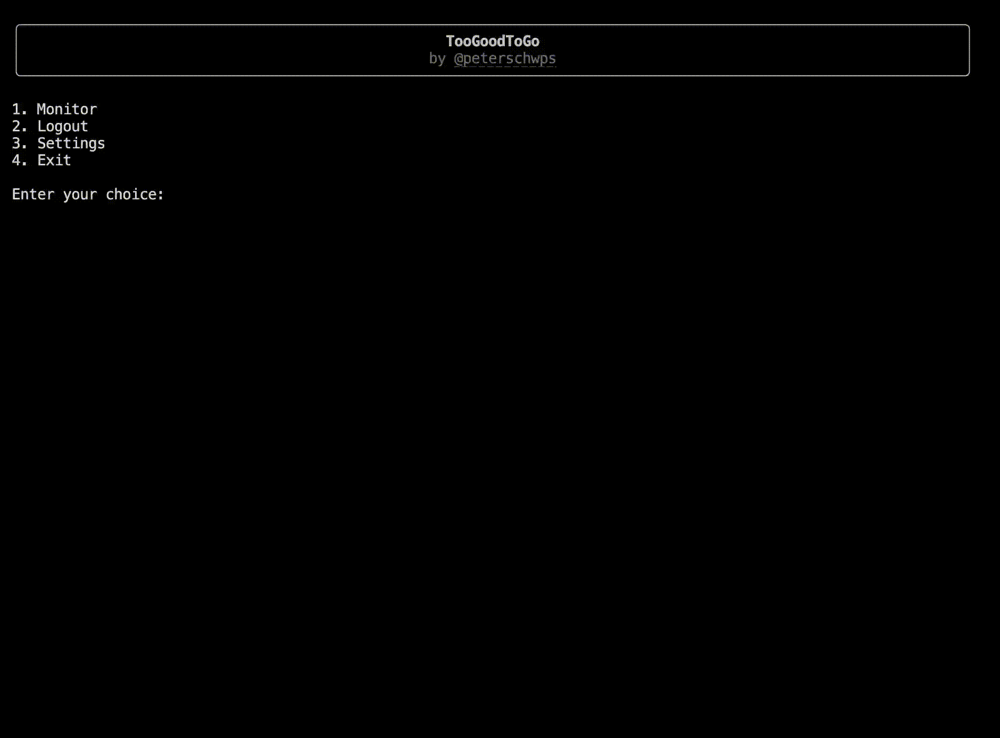

# TooGoodToGo CLI

**Unofficial CLI for Too Good To Go (TGTG) to monitor and check out items as
they become available.**

## Features

- **Interactive Menu** — guided flow, easy to navigate.
- **Account Login** — email-based passwordless login; persistent session.
- **Monitor Items** — watch any item in your area and wait for it to become
  available.
- **Mobile & Desktop Notifications** — get notified via the Ntfy app or
  website when monitored items become available.
- **Automatic Checkout** — handles the full checkout flow including any 3DS
  challenges, completing purchases in no time.
- **Easy Configuration** — all settings in a single file, editable in your
  default editor.

## Get started

-   __[Installation](installation.md)__

    Install globally with `uv` or `pipx`.

-   __[Quick Start](quickstart.md)__

    From zero to monitoring in a few steps.

-   __[Configuration](configuration.md)__

    Every setting explained in detail.

-   __[FAQ](faq.md)__

    Common questions and troubleshooting.

!!! tip
    For best results when using the automated checkout, a free virtual card
    from [Bunq](https://bunq.com) is recommended. See
    [Credit Cards](credit-cards.md) for more details.

!!! warning
    This project is an unofficial, independent third-party tool and is **not
    affiliated with Too Good To Go**. Use of this tool may violate the Too
    Good To Go Terms of Service. See the [Disclaimer](disclaimer.md) for
    details.
